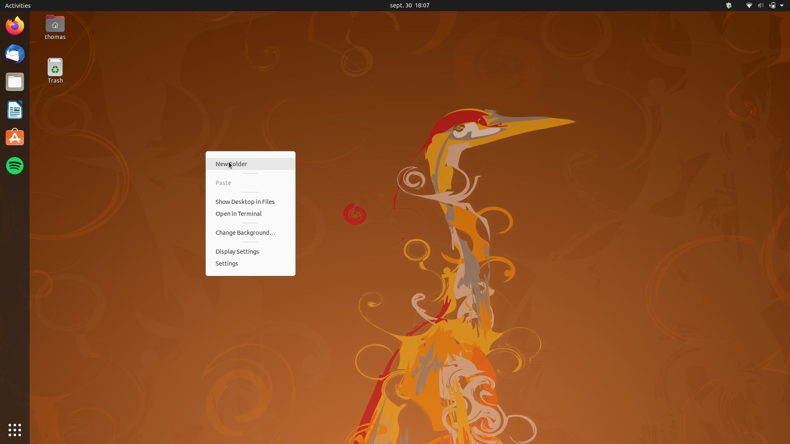
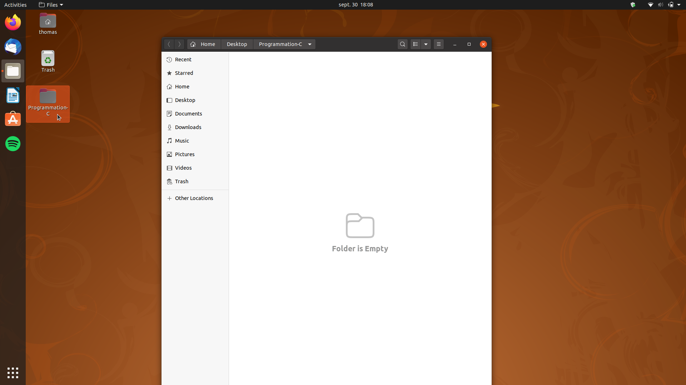
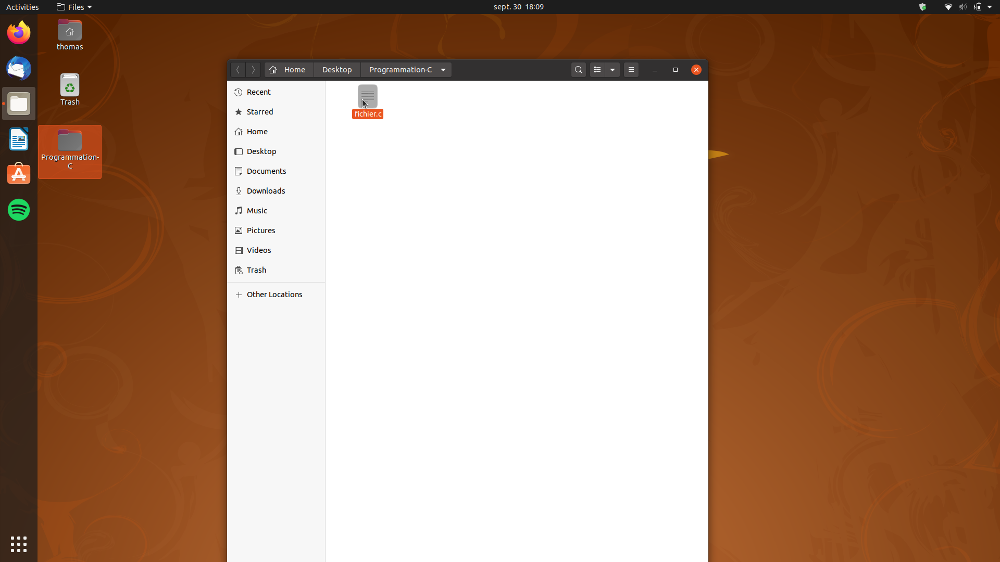
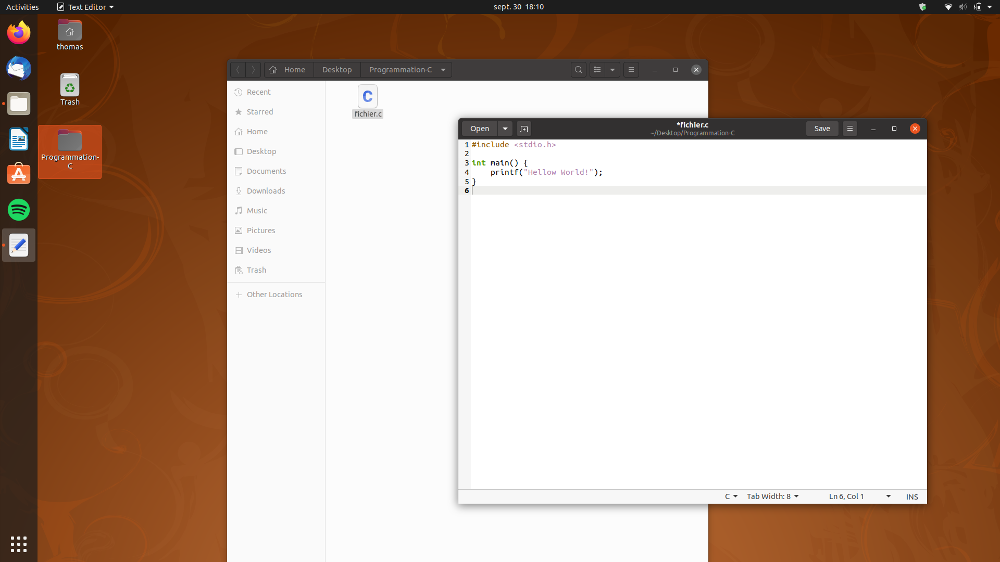
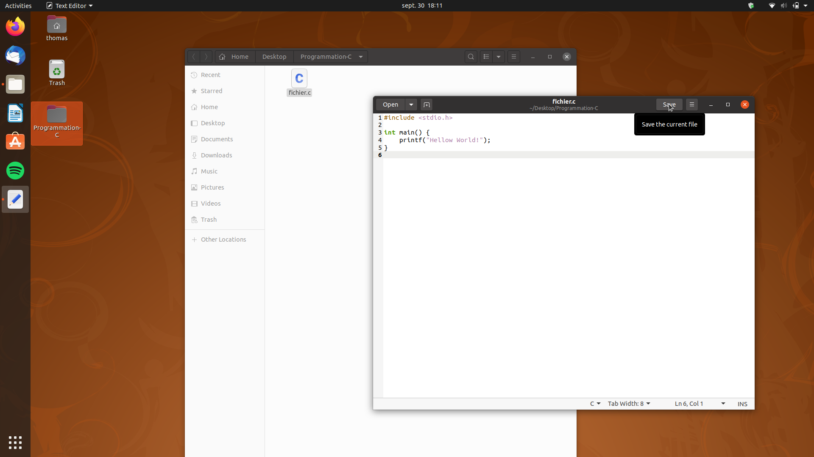
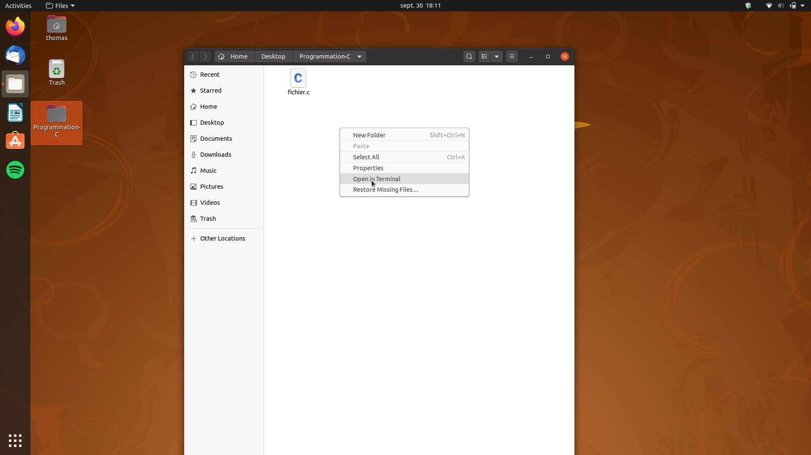
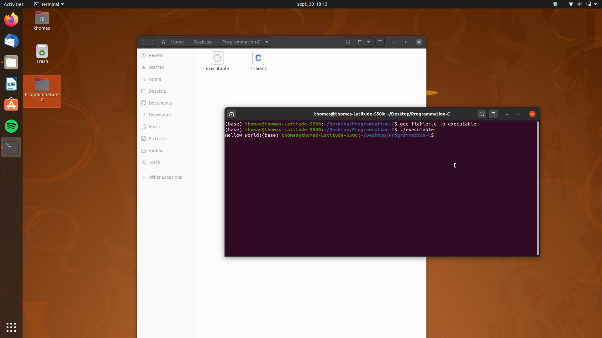

# Introduction à la compilation avec images

## Tutoriel en image pour créer et compiler un programme en C sur linux

- Afin d'organiser vos programmes, il est utile de créer un dossier à part. On utilise pour cela **clic droit** puis **créer un nouveau dossier**.

- Ouvrir ensuite le dossier en **double cliquant** dessus.

- Une fois dans le dossier, créer un nouveau fichier avec **clic droit** puis **créer un fichier vide**.

- Ouvrir le nouveau fichier avec un éditeur de texte (**double clic** par défault). Puis écrire le programme en question.

- Ne pas oublier de sauvegarder le fichier, auquel cas la compilation ne fonctionnera pas.

- Ouvrir un terminal avec **clic droit** puis **ouvrir un terminal ici**. Cela forcera le terminal a se positionner au niveau du dossier.

- Compiler en utilisant gcc, avec la commande `gcc nom_du_fichier.c -o nom_de_l'executable`.

- Un éxecutable est créé dans le dossier

- On lance l'éxecutable avec la commande `./nom_de_l'executable`.

- Si tout a fonctionné, le programme affiche le résultat dans le terminal.
