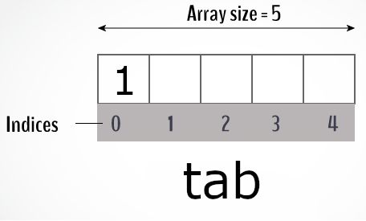

# <span style="color:green">Cours de Programmation C</span>

## <span style="color:blue">Partie 3: *Tableaux et Chaines de caractères*</span>

## Tableau

Un tableau en C est une **variable** qui peut contenir plusieurs valeurs. On le définit de la même manière qu'une variable, plus des ```[]``` indiquant que l'on souhaite créer un tableau. La taille du tableau est indiqué à l'intérieur des ```[]```.

```C
int tab[5];
```

Le code ci dessus déclare un tableau nommé "tab" pouvant stocker jusqu'à 5 valeurs de type ```int```.

Les cases d'un tableau utilisent ce que l'on apelle un **indice**. Un tableau de 5 cases sera indexé de **0 à 4**. On accède donc à la *première* valeur avec:

```C
tab[0];
```

et à la *dernière* avec:

```C
tab[4];
```

On peut ensuite **assigner une valeur** à une case du tableau en utilisant ces même indices:

```C
tab[0] = 1;
```



A part ces quelques subtilités, un tableau fonctionne de la même manière qu'une variable. On peut par exemple effectuer des opérations sur ses valeurs.


```c
#include <stdio.h>

int main() {
    int tab[4];
    tab[0] = 2;
    tab[1] = 4;
    tab[2] = 6;
    tab[3] = 8;

    int tab2[3]; // on declare un deuxième tableau
    tab2[0] = tab[0] + tab[1] + tab[2] + tab[3]; // la première case contient la somme des cases du premier tableau
    printf("tab2[0] = %d\n", tab2[0]);

    tab2[1] = tab[0] * tab[1] * tab[2] * tab[3]; // la deuxième case contient le produit des cases du premier tableau
    printf("tab2[1] = %d\n", tab2[1]);
}
```

    tab2[0] = 20
    tab2[1] = 384


### *Remarque:*

Il est possible de déclarer et assigner des valeurs à un tableau en même temps en utilisant des `{}`:

```C
int tab[4] = {10, 5, 8, 26};
```

## Boucle de contrôles et tableaux

Les boucles ```for``` sont particulièrement adaptées au fonctionnement des tableaux. Elle servent à parcourir tous les éléments 1 par 1 afin d'effectuer tout type d'opérations. Il suffit d'utiliser la variable de la boucle comme indice du tableau:


```c
#include <stdio.h>

int main() {
    int tab[10] = {0, 1, 2, 3, 4, 5, 6, 7, 8, 9}; // initialisation du tableau
    
    int somme = 0;
    for (int i = 0; i < 10; ++i) { // on calcul la somme du tableau avec une boucle for
        somme = somme + tab[i];
    }
    printf("somme = %d", somme);
}
```

    somme = 45

## <span style="color:red">Exercice 1</span>

**Exercice:**

- Lire un entier n, puis remplir un tableau de n éléments avec des entiers. Afficher le tableau, puis calculer le max, et le min de ses éléments.


```c
#include <stdio.h>

int main() {
    int n;
    printf("rentrer la taille du tableau\n");
    scanf("%d", &n);

    int tab[n];
    for (int i = 0; i < n; i++) {
        printf("donner un entier pour la case %d du tableau\n", i);
        scanf("%d", &tab[i]); // remplissage du tableau avec des entiers donnés par l'utilisateur
    }
    
    int min = tab[0];
    int max = tab[0];
    for (int i = 0; i < n; i++) {
        printf("tab[%d] = %d\n", i, tab[i]);
        if (tab[i] > max) {
            max = tab[i];
        }
        if (tab[i] < min) {
            min = tab[i];
        }
    }
    printf("min = %d\n", min);
    printf("max = %d\n", max);
}
```

    rentrer la taille du tableau
    4
    donner un entier pour la case 0 du tableau
    83
    donner un entier pour la case 1 du tableau
    86
    donner un entier pour la case 2 du tableau
    77
    donner un entier pour la case 3 du tableau
    15
    tab[0] = 83
    tab[1] = 86
    tab[2] = 77
    tab[3] = 15
    min = 15
    max = 86


## <span style="color:red">Exercice 2</span>

**Exercice:**

- Lire un entier n, puis n autres entiers inférieurs à 100 dans un tableau. Afficher le nombre d'occurrences de chaque élément du tableau de la façon suivante:

Si le tableau est: 1 2 5 2 1 2, on affiche:

1 est répété 2 fois.

2 est répété 3 fois.

5 est répété 1 fois.

Pas nécessairement dans un ordre précis, mais chaque élément ne doit être cité qu’une seule fois.


```c
#include <stdio.h>

int main() {
    int n;
    printf("rentrer la taille du tableau\n");
    scanf("%d", &n);

    int tab[n];
    int compte = 0;
    while(compte < n) {
        scanf("%d", &tab[compte]);
        if (tab[compte] >= 100) {
            printf("L'entier doit être inférieur à 100");
        } else {
            compte++;
        }
    }
    
    int tabOccurences[100];
    for (int i = 0; i < 100; i++) {
        tabOccurences[i] = 0;
    }
    
    for (int i = 0; i < n; i++) {
        printf("tab[%d] = %d\n", i, tab[i]);
        
        tabOccurences[tab[i]]++;
    }
    
    for (int i = 0; i < 100; i++) {
        if (tabOccurences[i] > 0) {
            printf("%d est répété %d fois\n", i, tabOccurences[i]);
        }
    }
}
```

    rentrer la taille du tableau
    10
    tab[0] = 69
    tab[1] = 42
    tab[2] = 78
    tab[3] = 78
    tab[4] = 70
    tab[5] = 39
    tab[6] = 49
    tab[7] = 39
    tab[8] = 66
    tab[9] = 58
    39 est répété 2 fois
    42 est répété 1 fois
    49 est répété 1 fois
    58 est répété 1 fois
    66 est répété 1 fois
    69 est répété 1 fois
    70 est répété 1 fois
    78 est répété 2 fois


## Tableau à plusieurs dimensions

Nous avons abordé les tableau à **1 dimension** (aussi appelé **vector**), mais il est possible de déclarer des tableaux à **dimensions multiples** (que l'on réfère comme **matrice**).

```C
int tab[2][2] = {{7, 5}, {15, 3}}; // déclare un tableau à 2 dimensions
```

On accède à un tableau à 2 dimensions de la même manière qu'un tableau à 1 dimension, mais en utilisant 2 indices au lieu d'un:

```C
tab[0][0] = 20;
```

Un tableau à 2 dimensions peut se représenter comme un arrangement de cases en lignes et colonnes.


Une 3eme dimension rajouterait de la profondeur (un genre de cube). Il est possible de déclarer des tableau avec autant de dimensions que l'on souhaite, mais au delà de 3, il devient difficile de se répresenter la forme du tableau.

## <span style="color:red">Exercice 3</span>

**Exercice:**
- Construire la table de multiplication des entiers entre 1 et 9 puis l'afficher.

Utiliser un tableau à 2 dimensions pour stocker les tables de multiplications.


```c
#include <stdio.h>

int main() {
    int table[9][9];
    
    for (int i = 0; i < 9; i++) {
        for (int j = 0; j < 9; j++) {
            table[i][j] = (i + 1) * (j + 1);
        }
    }
    
    for (int i = 0; i < 9; i++) {
        printf("table de multiplication de %d\n", i+1);
        for (int j = 0; j < 9; j++) {
            printf("%d * %d = %d\n", i+1, j+1, table[i][j]);
        }
    }
}
```

    table de multiplication de 1
    1 * 1 = 1
    1 * 2 = 2
    1 * 3 = 3
    1 * 4 = 4
    1 * 5 = 5
    1 * 6 = 6
    1 * 7 = 7
    1 * 8 = 8
    1 * 9 = 9
    table de multiplication de 2
    2 * 1 = 2
    2 * 2 = 4
    2 * 3 = 6
    2 * 4 = 8
    2 * 5 = 10
    2 * 6 = 12
    2 * 7 = 14
    2 * 8 = 16
    2 * 9 = 18
    table de multiplication de 3
    3 * 1 = 3
    3 * 2 = 6
    3 * 3 = 9
    3 * 4 = 12
    3 * 5 = 15
    3 * 6 = 18
    3 * 7 = 21
    3 * 8 = 24
    3 * 9 = 27
    table de multiplication de 4
    4 * 1 = 4
    4 * 2 = 8
    4 * 3 = 12
    4 * 4 = 16
    4 * 5 = 20
    4 * 6 = 24
    4 * 7 = 28
    4 * 8 = 32
    4 * 9 = 36
    table de multiplication de 5
    5 * 1 = 5
    5 * 2 = 10
    5 * 3 = 15
    5 * 4 = 20
    5 * 5 = 25
    5 * 6 = 30
    5 * 7 = 35
    5 * 8 = 40
    5 * 9 = 45
    table de multiplication de 6
    6 * 1 = 6
    6 * 2 = 12
    6 * 3 = 18
    6 * 4 = 24
    6 * 5 = 30
    6 * 6 = 36
    6 * 7 = 42
    6 * 8 = 48
    6 * 9 = 54
    table de multiplication de 7
    7 * 1 = 7
    7 * 2 = 14
    7 * 3 = 21
    7 * 4 = 28
    7 * 5 = 35
    7 * 6 = 42
    7 * 7 = 49
    7 * 8 = 56
    7 * 9 = 63
    table de multiplication de 8
    8 * 1 = 8
    8 * 2 = 16
    8 * 3 = 24
    8 * 4 = 32
    8 * 5 = 40
    8 * 6 = 48
    8 * 7 = 56
    8 * 8 = 64
    8 * 9 = 72
    table de multiplication de 9
    9 * 1 = 9
    9 * 2 = 18
    9 * 3 = 27
    9 * 4 = 36
    9 * 5 = 45
    9 * 6 = 54
    9 * 7 = 63
    9 * 8 = 72
    9 * 9 = 81


## Chaînes de caractères

Une **chaînes de caractères** est une suite ordonnée de caractères permettant de stocker et afficher des mots, phrases et plus. Nous les utilisons depuis le début sans y faire attention, tel que ```"Hello World!"``` ou tout autre phrase entre ```""```. On initialise une chaînes de caractères avec:

```C
char chaine[] = "du texte";
```

On remarque l'utilisation des ```[]``` comme pour un tableau. C'est parce qu'une chaînes de caractère n'est rien d'autre qu'un **tableau de caractères**. Ici, le nombre d'éléments du tableau n'est pas indiqué, il est donc automatiquement calculé lors de l'initialisation de la chaînes.

On aurait pu écrire:

```C
char chaine[9] = "du texte"; // "du texte" contient 9 caracteres (8 + 1 caractere indiquant la fin de la chaine)
```

On peut afficher une chaînes de caractères de la même manière qu'on affiche tout autre variable, avec le mot clé ```%s``` (pour **string** en anglais):


```c
#include <stdio.h>

int main() {
    char chaine[] = "du texte";
    printf("chaine = %s", chaine);
}
```

    chaine = du texte

Etant donné qu'une chaînes de caractères est un tableau, il est possible d'utiliser les mêmes méthodes que ces derniers pour modifier la chaînes.


```c
#include <stdio.h>

int main() {
    char chaine[] = "du texte";
    chaine[5] = 'z';
    printf("chaine = %s\n", chaine);
    
    for (int i = 0; i < 9; i++) {
        chaine[i] = chaine[i] + 1;
    }
    printf("chaine = %s\n", chaine);
}
```

    chaine = du tezte
    chaine = ev!uf{uf


**Attention**: il faut utiliser les ```''``` simples pour les caracteres, les ```""``` doubles pour les chaînes de caractères.

## <span style="color:red">Exercice 4</span>

**Exercice:**

- Lire une chaîne de caractères et vérifier si elle est un palindrome ou non. On rappelle qu'un palindrome se lit de la même manière dans les deux sens.

Exemple: "non", "touot" et "1234321" sont toutes des chaînes de caractères palindromes.


```c
#include <stdio.h>
#include <string.h> // charge des fonctions utiles pour manipuler des chaines de caracteres (tel que strlen)

int main() {
    char chaine[100]; // on déclare une chaine de 100 caractère car on ne connait pas sa taille à l'avance
    printf("Rentrer une chaine de caracteres\n");
    scanf("%s", chaine);
    
    int longeur = strlen(chaine); // retourne la taille de la chaine de caractere (attention au caractere de fin de chaine)
    
    int palyndrome = 1;
    for (int i = 0; i < (longeur / 2); i++) {
        if (chaine[i] != chaine[longeur-1-i]) {
            palyndrome = 0;
            break;
        }
    }
    
    if (palyndrome) {
        printf("%s est un palyndrome\n", chaine);
    } else {
        printf("%s n'est pas un palyndrome\n", chaine);
    }
}
```

    Rentrer une chaine de caracteres
    non
    non est un palyndrome


## <span style="color:red">Exercice 5 (Facultatif)</span>

**Exercice:**

- Lire deux chaînes de caractères et vérifier si la deuxième est une sous chaîne de la première ou non.

Exemple: "tout" est une sous chaîne de "surtout".


```c
#include <stdio.h>
#include <string.h>

int main() {
    char chaine1[100];
    char chaine2[100];
    printf("Rentrer une premiere chaine de caracteres\n");
    scanf("%s", chaine1);
    printf("Rentrer une deuxieme chaine de caracteres\n");
    scanf("%s", chaine2);
    
    int longueur1 = strlen(chaine1);
    int longueur2 = strlen(chaine2);
    
    int sousChaine;
    for (int i = 0; i < longueur1; i++) {
        sousChaine = 1;
        if (chaine1[i] == chaine2[0]) {
            for (int j = 1; j < longueur2; j++) {
                if (chaine1[i+j] != chaine2[j]) {
                    sousChaine = 0;
                    break;
                }
            }
            if (sousChaine) {
                break;
            }
        }
    }
    
    if (sousChaine) {
        printf("%s est une sous chaine de %s\n", chaine2, chaine1);
    } else {
        printf("%s n'est pas une sous chaine de %s\n", chaine2, chaine1);
    }
}
```

    Rentrer une premiere chaine de caracteres
    touto
    Rentrer une deuxieme chaine de caracteres
    surtout
    touto n'est pas une sous chaine de surtout

